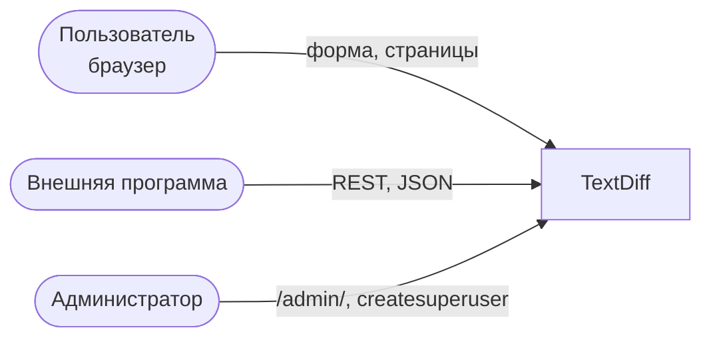
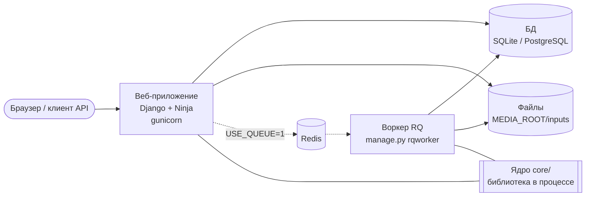
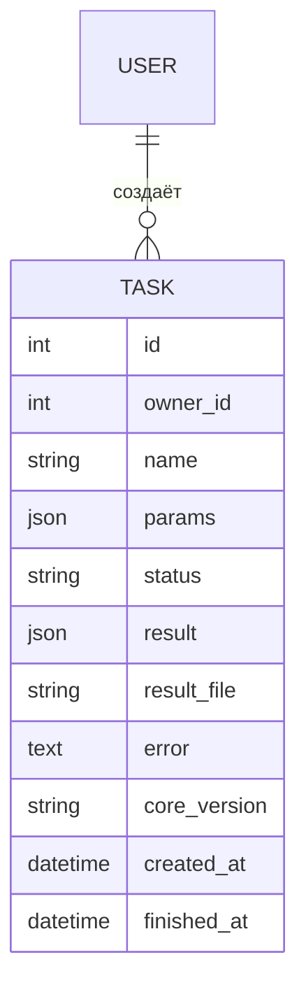
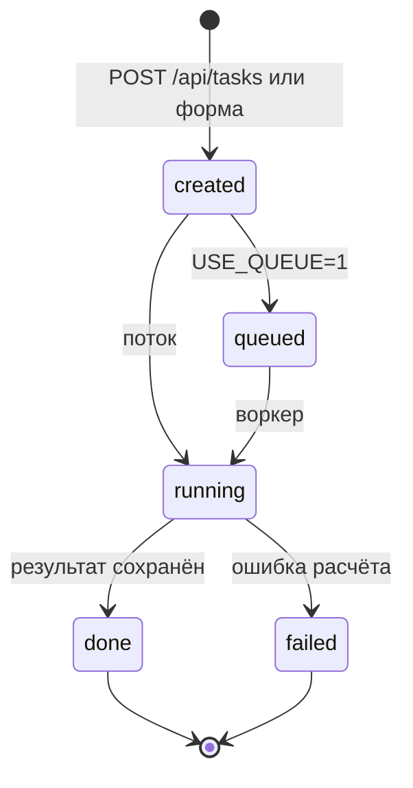
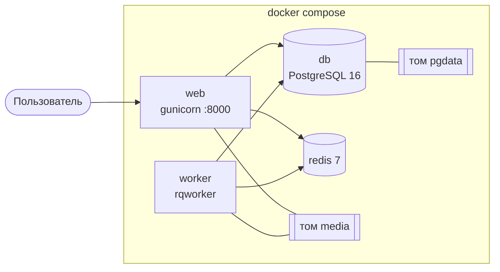

# Архитектура проекта TextDiff

Документ описывает, что делает TextDiff, из чего он состоит и почему устроен именно так. Состояние на 02.10.2026.
Связанные документы: `README.md`, `docs/api.md`, `docs/er-diagram.md`, `docs/security_review.md`, `docs/fat_review.md`,
`docs/adr/`.

**Авторы разделов**

Роли команды — как в `README.md`, раздел «Вклад». Редактор и сборщик документа — Джамиев Амин; текст каждого раздела написал и может
защитить указанный автор.

| № | Раздел | Автор | Соавтор и что именно написал |
| --- | --- | --- | --- |
| 1 | Назначение и контекст | Джамиев Амин (Frontend + Docs) | — |
| 2 | Требования и ограничения | Джамиев Амин (Frontend + Docs) | Ахмадов Магомед: требования Т2 и Т6, риск про TTR |
| 3 | Контейнеры (C4, уровень 2) | Зайналабдиев Рамзан (Backend) | — |
| 4 | Компоненты веб-приложения (C4, уровень 3) | Зайналабдиев Рамзан (Backend) | — |
| 5 | Модель данных | Зайналабдиев Рамзан (Backend) | — |
| 6 | API | Темирсултанов Магомед (API) | — |
| 7 | Вычислительное ядро | Ахмадов Магомед (Core) | — |
| 8 | Безопасность и доступ | Джамиев Амин (Frontend + Docs) | Темирсултанов Магомед: вход и изоляция в API; Зайналабдиев Рамзан: вход и изоляция в views, секреты и режимы; Ахмадов Магомед: проверка входа схемой |
| 9 | Развёртывание | Зайналабдиев Рамзан (Backend) | — |
| 10 | Эксплуатация | Зайналабдиев Рамзан (Backend) | Темирсултанов Магомед: строки таблицы проблем про `401`, `400`, `422` |
| 11 | Решения (ADR) | Джамиев Амин (Frontend + Docs) | — |
| 12 | Ретроспектива | Джамиев Амин (Frontend + Docs) | Ахмадов Магомед, Зайналабдиев Рамзан, Темирсултанов Магомед: свои пункты (см. начало раздела) |

## 1. Назначение и контекст

> **Автор:** Джамиев Амин (Frontend + Docs)

TextDiff — веб-сервис статистического сравнения двух групп текстов. Пользователь загружает CSV, где у каждого текста есть метка
группы (позитивные и негативные отзывы, тексты двух авторов), и получает ответ на вопрос: различаются ли группы по лексике
значимо или различие может быть случайным. Это специализация темы курса №5 «Статистический анализ загружаемого набора данных»
на текстовых данных (ADR-002).

**Для кого:** студент или аналитик, которому нужно быстро проверить гипотезу о различии двух корпусов, и программа,
которая делает то же самое через REST API.

**Что делает система:**

* принимает CSV (UTF-8, до 10 МБ) с колонками текста и группы;
* считает по каждой группе среднюю длину текста, TTR, среднюю длину слова, частоты слов;
* проверяет различие групп тестом Манна — Уитни, t-критерием Уэлча или собственным перестановочным тестом;
* хранит задачи и результаты, каждому пользователю показывает только его собственные.

**Чего сознательно не делает:**

* не определяет тональность и не классифицирует тексты, только сравнивает лексические метрики;
* не сравнивает больше двух групп (схема отклоняет такой вход);
* не строит графики и не считает регрессию по закону Ципфа и TF-IDF (запланировано на межсессию 1);
* не имеет саморегистрации: пользователей создаёт администратор;
* не рассчитан на большую нагрузку: расчёт идёт в потоке внутри сервера (ADR-004).

**Контекст системы (C4, уровень 1):**

Внешних систем у TextDiff нет: он не обращается к сторонним сервисам, и данные не покидают сервер.

## 2. Требования и ограничения

> **Автор:** Джамиев Амин (Frontend + Docs). **Соавтор:** Ахмадов Магомед (Core) — требования Т2 и Т6, риск про TTR.

**Ключевые требования:**

| № | Требование |
| --- | --- |
| Т1 | Загрузка CSV с настраиваемыми именами колонок, понятные сообщения об ошибках входа |
| Т2 | Три статистических теста на выбор, воспроизводимый результат (один `seed` — один ответ) |
| Т3 | Запрос не блокируется расчётом: ответ сразу, результат позже |
| Т4 | Пользователь видит только свои задачи, чужая задача неотличима от несуществующей |
| Т5 | Одинаковый контракт для страницы и для API |
| Т6 | Вычислительное ядро проверяется отдельно, без веба и базы |

**Ограничения:** команда из четырёх человек, срок — два интенсива и межсессия; стек Django 5.2 + Django Ninja (ADR-001),
Pydantic для проверки входа, SciPy для стандартных тестов; в разработке SQLite, в Docker PostgreSQL.

**Главные качественные атрибуты:** корректность и воспроизводимость расчётов, изоляция данных пользователей,
отделимость ядра от веба. **Чем пожертвовали:** масштабируемостью и отказоустойчивостью фоновых задач (поток вместо очереди),
единством пределов размера входа.

**Риски:**

| Риск | Состояние |
| --- | --- |
| Фоновые потоки обрываются при перезапуске сервера, задача навсегда остаётся в `running` | принят, решение — очередь RQ (`USE_QUEUE=1`) |
| Форма принимает до 10 МБ, API отклоняет тело больше 2,5 МБ | принят, открыт (`security_review.md`, п. 4) |
| TTR зависит от длины текста, сравнение групп разной длины нечестное | описан в разделах 7 и 12, метрика не исправлена |
| Входной CSV не удаляется вместе с задачей | принят (ADR-006) |
| Нет ограничения частоты запросов | не решался |

## 3. Контейнеры (C4, уровень 2)

> **Автор:** Зайналабдиев Рамзан (Backend)

| Контейнер | Что делает |
| --- | --- |
| Веб-приложение | страницы, форма, REST API, вход пользователей, запуск расчёта (в потоке) |
| БД | пользователи, задачи (`Task`): параметры, статус, результат, ошибка |
| Файловое хранилище | входные CSV задач в `MEDIA_ROOT/inputs/` (ADR-006), файлы результатов |
| Redis и воркер | необязательная пара: при `USE_QUEUE=1` расчёт идёт не в потоке, а в очереди |
| Ядро `core/` | не отдельный процесс, а библиотека: её вызывают и веб-приложение (в потоке), и воркер |

В обычном режиме (`USE_QUEUE=0`) работают только веб-приложение, БД и папка с файлами.

## 4. Компоненты веб-приложения (C4, уровень 3)

> **Автор:** Зайналабдиев Рамзан (Backend)

Слои и единственное направление зависимостей: **`views / api → services → core`**.

| Слой | Файлы | Ответственность |
| --- | --- | --- |
| Представления | `web/views.py`, `web/forms.py`, `templates/` | HTTP, форма, страницы; ничего не считают |
| API | `api/api.py` | REST на Django Ninja, авторизация `django_auth`, фильтр по владельцу |
| Сервисы | `web/services.py` | разбор CSV, создание задачи, сохранение входного файла, запуск расчёта, смена статусов |
| Очередь | `web/jobs.py` | постановка задачи в RQ (режим `USE_QUEUE=1`) |
| Модель | `web/models.py` | `Task` |
| Ядро | `core/solver.py`, `core/schemas.py` | проверка входа и все вычисления |

**Как соблюдено правило зависимостей:**

* `core/` не импортирует Django, не обращается к БД, HTTP и файлам; принимает `dict` и возвращает `dict`;
* views и API не содержат вычислений, они вызывают `services` (разбор в `docs/fat_review.md`);
* статус задачи меняется только в `services.execute_task` и `jobs.enqueue_task`;
* парсинг CSV и работа с файлами живут в `services`, а не в ядре, чтобы ядро оставалось чистым.

**Где идёт расчёт.** `services.create_task` проверяет вход схемой, создаёт `Task`, сохраняет входной CSV в файл и запускает
`execute_task` в потоке (`daemon=True`, `connection.close()` в конце) или ставит задачу в очередь. Клиент сразу получает `202`.
Для тестов есть переключатель `TASKS_SYNC=1`: задача считается в том же потоке, без фонового (ADR-004).

## 5. Модель данных

> **Автор:** Зайналабдиев Рамзан (Backend)

Основная сущность — `Task`. Отдельной сущности «Результат» нет: результат лежит в `Task.result`, потому что он небольшой
(статистики по двум группам и топ слов).

**Что хранится в `params`:** настройки анализа (`test`, `top_n`, `n_permutations`, `seed`, имена колонок), `input_file` — путь к
входному CSV относительно `MEDIA_ROOT` и `n_rows` — число строк. Сами тексты в базу не попадают.

**Где хранятся большие данные и почему.** Входной CSV лежит файлом `MEDIA_ROOT/inputs/task_<id>.csv` (ADR-006). Раньше он
копировался в `params`: файл 9,3 МБ раздувал базу до 52,6 МБ. Теперь в базе остаются сотни байт на задачу. Для больших
результатов в модели есть `result_file`. Задачи, созданные до этого решения (строки прямо в `params["rows"]`), читаются как раньше.

Связь с пользователем: один пользователь — много задач. Поле `owner` допускает пустое значение (технически можно создать задачу
без владельца), но через сайт и API владелец всегда заполнен.

## 6. API

> **Автор:** Темирсултанов Магомед (API)

Подробное описание, примеры запросов и ответов — `docs/api.md`. Интерактивная документация — `/api/docs`.

| Метод | Путь | Запрос | Ответ | Коды |
| --- | --- | --- | --- | --- |
| `POST` | `/api/tasks` | `{name, params}` | задача: `id`, `name`, `status`, `core_version`, `error` | `202`, `401`, `422` |
| `GET` | `/api/tasks` | `?status=` | список своих задач (до 100) | `200`, `401` |
| `GET` | `/api/tasks/{id}` | — | задача | `200`, `401`, `404` |
| `GET` | `/api/tasks/{id}/result` | — | `{id, status, result}` | `200`, `401`, `404`, `409` |

**Формат ошибок:** `{"detail": "текст"}`. `422` — вход не прошёл проверку (задача не создаётся), `409` — результат запрошен до
завершения, `404` — задачи нет или она чужая, `401` — нет входа. Ответ `400` на тело больше 2,5 МБ формирует сам Django.

**Состояния задачи:**

## 7. Вычислительное ядро

> **Автор:** Ахмадов Магомед (Core)

**Контракт.** Единственная точка входа — `core.run(params) -> dict`. Версия ядра (`core.VERSION`) пишется в результат и в
`Task.core_version`.

| Вход (`TextDiffParams`) | Ограничения |
| --- | --- |
| `rows` | от 2 до 50 000 строк `{text, group}`; ровно две группы; в каждом тексте хотя бы одно слово |
| `test` | `mannwhitney`, `ttest`, `permutation` |
| `top_n`, `n_permutations`, `seed` | 1…200, 1…200 000, любое целое |

Выход: по каждой группе `n_texts`, `avg_len_words`, `avg_ttr`, `avg_word_len`; `statistic`, `pvalue`; `top_words`; для
перестановочного теста ещё `permutations_used` и `permutations_exact`; а также `core_version` и `elapsed_sec`.

**Ошибки.** Неверный вход отклоняет схема до расчёта: ядро бросает ошибку проверки, а API превращает её в `422`,
а форма — в сообщение у поля. Ошибка во время расчёта фиксируется в задаче: статус `failed` и текст в `error`.

**Как считается.** Словом считается последовательность русских или латинских букв (`WORD_RE`), регистр не важен. TTR текста —
число уникальных слов, делённое на число всех слов. Группы сравниваются по TTR отдельных текстов. Стандартные тесты берутся из
SciPy; при полностью совпадающих группах p-value принудительно равно 1,0, а `NaN` заменяется на `None`, чтобы результат оставался
валидным JSON. Перестановочный тест (`permutation_test`) — собственная реализация: если число разбиений `C(n, na)` не больше
заказанного числа перестановок, перебираются все разбиения (результат точный, `seed` не нужен, `p = k / N`); иначе берутся
случайные перестановки через `random.Random(seed)` с поправкой `p = (k + 1) / (N + 1)`, которая исключает нулевое p-value.

**Эталонные задачи и проверка корректности.**

* Группы `[1, 1]` и `[3, 3]`, перестановочный тест: `p = 2/6`. Ответ посчитан вручную: пул `[1, 1, 3, 3]` делится на две пары
  шестью способами, и только два из них (крайние) дают разность средних не меньше наблюдаемой, равной 2. Закреплено тестом
  `test_permutation_test_matches_known_example`.
* Две полностью непохожие группы по десять значений при выборке: `p = 1/1001`, а не 0 (`test_sampled_pvalue_never_zero`).
* Один и тот же `seed` даёт один и тот же результат (`test_permutation_test_same_seed_is_reproducible`).
* Одинаковые группы дают `p = 1,0` без `NaN`.

Всего в проекте 31 тест: ядро — 11, API — 9, сценарии через сайт — 5, сервисный слой — 6. CI на GitHub Actions запускает
`ruff check .` и `pytest -q` на каждый `push` и `pull_request`.

**Ограничения по времени и памяти.** Замер (`python measure.py`, перестановочный тест, 1000 перестановок): 100 текстов —
0,03 с, 1000 — 0,33 с, 4000 — 1,26 с; рост линейный. Нагрузка зависит и от числа перестановок, поэтому в схеме есть граница
`строк × перестановок ≤ 40 000 000` (`LIMIT`): 4000 строк × 10 000 перестановок считаются около 13 секунд. Без границы вход
2000 × 200 000 отвечал только через 66,6 с, а 50 000 × 200 000 занял бы около 40 минут. Входные данные читаются в память целиком
(до 50 000 строк); отдельного ограничения памяти нет.

**Ограничение метода: длина текста и TTR.** Доля разных слов падает, когда текст длиннее: чем больше слов, тем чаще они
повторяются, даже если словарь автора не изменился. Поэтому у короткого текста TTR в среднем выше, чем у длинного. Если группы
различаются по средней длине текстов, разницу TTR нельзя целиком отнести на счёт разнообразия лексики: часть разницы создаёт
сама длина, а тест этого не отделяет. **Сравнение групп с заметно разной длиной текстов нечестное.** Тесты фиксируют эффект:
для одного и того же словаря из 10 слов TTR равен 1,0 у текста в 10 слов и 0,2 у текста в 50 слов (`test_ttr_drops_when_text_gets_longer`),
а две группы с одинаковым словарём, но разной длиной, дают разный средний TTR (`test_groups_with_different_text_length_differ_in_ttr_even_with_same_vocabulary`).
Что сделано: средняя длина текстов по группам (`avg_len_words`) показывается на странице результата и в API рядом с TTR,
чтобы различие в длине было видно. Чего нет: поправки на длину и предупреждения в интерфейсе. Как читать результат: сначала
сравнить `avg_len_words` групп, и если они сильно различаются, считать вывод по TTR предварительным.

Другие ограничения метода: слова считаются только из букв русского и латинского алфавитов (цифры и другие алфавиты
игнорируются), сравниваются ровно две группы, а p-value считается по TTR текстов, а не по всем метрикам сразу.

## 8. Безопасность и доступ

> **Авторы:** Джамиев Амин (Frontend + Docs) — общий разбор, угрозы и открытые риски; Темирсултанов Магомед (API) — вход и изоляция в API (`django_auth`, `401`, `404`); Зайналабдиев Рамзан (Backend) — вход и изоляция в views, секреты и режимы; Ахмадов Магомед (Core) — проверка входа схемой.

Подробный разбор из 8 пунктов — `docs/security_review.md`.

**Аутентификация и роли.** Ролей две: обычный пользователь и администратор (`/admin/`). Вход обязателен для всех страниц и
всего API: `@login_required` во views, `auth=django_auth` в API (аноним получает `401`, страницы перенаправляют на вход).
Саморегистрации нет, пользователей создаёт администратор.

**Изоляция данных.** Каждый запрос к задачам фильтруется по владельцу (`owner=request.user`) и в views, и в API. Чужая задача
отвечает `404`, а не `403`, чтобы не раскрывать существование задачи (ADR-005). Проверено тестами для сайта и для API.

**Что защищено фреймворком:** CSRF (токен в формах и в заголовке для `POST` в API), хранение паролей, сессии, экранирование
вывода в шаблонах (название задачи с `<script>` выводится как текст).

**Секреты и режимы.** `SECRET_KEY` берётся только из `.env` или окружения, запасного значения нет: нет ключа — сервер не
запускается. `.env` закрыт в `.gitignore`. `DEBUG` по умолчанию выключен. Версии зависимостей закреплены через `==`.

**Проверка входа.** Всё, что пришло от пользователя, проходит схему Pydantic до расчёта; `eval` и `exec` на пользовательских
строках не используются. Путь к входному файлу задачи читается только из папки `MEDIA_ROOT/inputs/`, выход за её пределы
отклоняется (тест `test_input_path_outside_inputs_folder_is_rejected`).

**Угрозы, которые проверены:** доступ к чужим задачам (закрыто), тяжёлый вход, блокирующий сервер (граница `LIMIT`, расчёт в
фоне), запасной ключ и режим отладки (закрыто), нестабильные версии зависимостей (закреплены), хранение CSV в базе
(вынесено в файл, ADR-006).

**Открытые риски:** разные пределы размера у формы и API; в `docker-compose.yml` для учебного запуска подставляется
`dev-only-insecure-key`, если `SECRET_KEY` не задан (перед реальным запуском ключ нужно задать); нет ограничения частоты запросов.

## 9. Развёртывание

> **Автор:** Зайналабдиев Рамзан (Backend)

**Диаграмма развёртывания (Docker Compose):**

`web` и `worker` делят том `media`, потому что воркер читает входные CSV, которые записал `web` (ADR-006).

**Переменные окружения:**

| Переменная | Назначение | По умолчанию |
| --- | --- | --- |
| `SECRET_KEY` | ключ Django, обязателен | нет (без него сервер не запустится) |
| `DEBUG` | режим отладки (`1` — включить) | `0` |
| `ALLOWED_HOSTS` | допустимые адреса через запятую | `localhost,127.0.0.1` |
| `USE_QUEUE` | `1` — расчёт в очереди RQ вместо потока | `0` |
| `REDIS_URL` | адрес Redis | `redis://localhost:6379/0` |
| `DATABASE_URL` | адрес PostgreSQL; без него — SQLite | SQLite `db.sqlite3` |
| `TASKS_SYNC` | `1` — считать без потока (для тестов) | `0` |

**Установка:** `python -m venv .venv`, `pip install -r requirements.txt`, `cp .env.example .env`, `python manage.py migrate`,
`python manage.py createsuperuser`, `python manage.py runserver` (разработка). В Docker: `docker compose up --build`.

**Обновление:** получить новую версию кода, `pip install -r requirements.txt`, `python manage.py migrate`, перезапустить
сервер. **Откат:** вернуть предыдущую версию кода и резервные копии БД и папки `media/`. Перед обновлением делайте
резервную копию (раздел 10).

**Среда без интернета.** Приложение само не обращается во внешние сервисы и не подключает внешние скрипты в шаблонах. Для
установки без сети нужен локальный индекс пакетов (или каталог wheel-файлов) и заранее собранные образы Docker. Страница
`/api/docs` по умолчанию подгружает файлы Swagger UI с CDN, поэтому без интернета она не откроется; сам API работает.

**Расхождение версий.** `Dockerfile` собирает образ на `python:3.14-slim`, а CI проверяет проект на Python 3.12.

## 10. Эксплуатация

> **Автор:** Зайналабдиев Рамзан (Backend). **Соавтор:** Темирсултанов Магомед (API) — строки таблицы проблем про `401`, `400`, `422`.

**Логи.** Отдельной настройки логирования нет: сервер пишет в стандартный вывод (`runserver` или `gunicorn`), в Docker
смотреть `docker compose logs web worker`. Причина сбоя расчёта сохраняется в `Task.error`.

**Проверка работоспособности.** Отдельного health-check нет. Достаточно открыть `/accounts/login/` (должен ответить `200`) и
посмотреть статус свежей задачи.

**Резервная копия.** Копировать нужно два места: базу (`db.sqlite3` или том `pgdata`) и папку `media/` (входные CSV задач).
Без файлов задачи в базе останутся, но пересчитать их нельзя.

**Типовые проблемы:**

| Симптом | Причина и действие |
| --- | --- |
| сервер не стартует, `KeyError: 'SECRET_KEY'` | нет `.env`: `cp .env.example .env` |
| API отвечает `401` | нет входа, сначала `/accounts/login/` |
| задача навсегда «Считается» | сервер перезапустили во время расчёта: создать задачу заново (для надёжности — `USE_QUEUE=1`) |
| задача «В очереди» не двигается | не запущен воркер: `python manage.py rqworker` или сервис `worker` |
| задача `failed`, «Входной файл задачи не найден» | потеряна папка `media/`: восстановить из резервной копии |
| API отвечает `400` на большой запрос | тело больше 2,5 МБ: загрузить через форму (до 10 МБ) |
| `422` «Слишком большой расчёт» | уменьшить число перестановок или размер выборки |

**Что делает администратор:** создаёт пользователей (`createsuperuser` или `/admin/` → Users), смотрит и удаляет задачи
в `/admin/` (файл входных данных при удалении остаётся на диске, ADR-006), следит за свободным местом в `media/`.

## 11. Решения (ADR)

> **Автор:** Джамиев Амин (Frontend + Docs)

| ADR | Решение | Суть |
| --- | --- | --- |
| [001](adr/001-stack.md) | Стек | Django + Django Ninja: вход, админка, миграции из коробки, Pydantic-схемы и Swagger |
| [002](adr/002-topic.md) | Тема проекта | специализация темы №5 на текстовых данных |
| [003](adr/003-input-and-execution.md) | Формат входа | один CSV с колонками `text` и `group`, парсинг в `services`, а не в ядре |
| [004](adr/004-thread-not-queue.md) | Поток, а не очередь | запрос отвечает сразу; риск: при перезапуске задача зависает в `running`; в тестах поток отключён |
| [005](adr/005-access-control.md) | Доступ | задача видна только владельцу, чужая — `404` |
| [006](adr/006-csv-in-file.md) | CSV в файле | в базе путь и настройки, сами данные на диске |

## 12. Ретроспектива

> **Авторы:** Джамиев Амин (Frontend + Docs) — «Что получилось хорошо» и «Что осталось недоделанным»; в «Что сделали бы иначе»: п. 1 — Ахмадов Магомед (Core); п. 2, 3, 5, 7 — Зайналабдиев Рамзан (Backend); п. 4 — Зайналабдиев Рамзан (Backend) и Темирсултанов Магомед (API); п. 6 — Темирсултанов Магомед (API).

**Что получилось хорошо.** Ядро отделено от веба: его проверяют отдельно, а эталон `2/6` посчитан вручную до написания кода и
ловит поломку перестановок. Вход проверяется схемой до расчёта, поэтому плохие данные не создают задач. Доступ закрыт в
каждом слое и покрыт тестами для сайта и для API. Каждое решение с компромиссом записано в ADR вместе с риском.

**Что сделали бы иначе.**

1. **Метрика и длина текстов.** Выбрали обычный TTR, потому что его проще всего объяснить, но он зависит от длины текста: доля
   разных слов падает, когда текст длиннее. При разной длине групп сравнение нечестное (раздел 7). Лучше сразу брать
   метрику, устойчивую к длине (например, TTR по скользящему окну фиксированной длины или по первым N словам каждого текста),
   либо сравнивать группы только после выравнивания длины, а в интерфейсе предупреждать, когда средняя длина групп сильно
   различается. Сейчас длина показывается на странице, но предупреждения и поправки нет.
2. **Тесты и потоки.** Сценарный тест изредка падал: тест и фоновый поток одновременно работали с базой. Расчёт в потоке нужно было
   сразу проектировать с переключателем «без потока для тестов». Теперь он есть (`TASKS_SYNC`), а запуск потока проверяется
   отдельным тестом с подменой `Thread`.
3. **Хранение входных данных.** Первая версия клала CSV целиком в JSON-поле базы: файл 9,3 МБ раздул базу до 52,6 МБ. Вынести
   большие данные в файл надо было в первой версии модели, а не после проверки безопасности (ADR-006).
4. **Доступ с самого начала.** Поле `owner` заполнялось, но не использовалось: до проверки любой видел чужие задачи. Фильтр по
   владельцу и обязательный вход стоило закладывать вместе с моделью, а не отдельным шагом.
5. **Очередь вместо потока.** Поток проще, но обрывается при перезапуске сервера. Для реальной нагрузки нужен RQ + Redis
   (код уже есть, включается флагом).
6. **Единые пределы размера.** Форма принимает до 10 МБ, API — до 2,5 МБ с ответом не нашего формата. Нужен один предел и один
   формат ошибки.
7. **Одна версия Python.** Образ Docker собирается на 3.14, а CI проверяет на 3.12: стоило выбрать одну.

**Что осталось недоделанным.** Регрессия по закону Ципфа и сравнение по TF-IDF (запланированы), удаление входных файлов вместе с
задачей, ограничение частоты запросов, единый предел размера входа.
