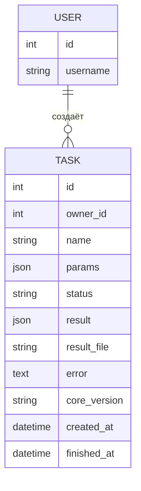

# ER-диаграмма TextDiff (КТ1)

В стартере для этапа 1 отдельной сущности `Result` нет: результат хранится в `TASK.result`, а большие результаты в дальнейшем выносятся в `TASK.result_file`, как предусмотрено моделью стартера.
