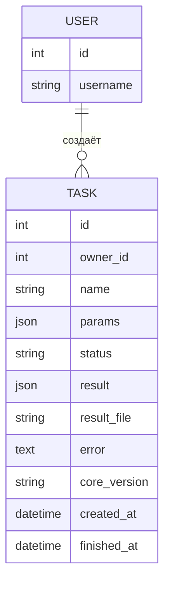

# ER-диаграмма TextDiff (КТ1)

```mermaid
erDiagram
    USER ||--o{ TASK : создаёт
    USER {
        int id
        string username
    }
    TASK {
        int id
        int owner_id
        string name
        json params
        string status
        json result
        string result_file
        text error
        string core_version
        datetime created_at
        datetime finished_at
    }
```

В стартере для этапа 1 отдельной сущности `Result` нет: результат хранится в `TASK.result`, а большие результаты в дальнейшем выносятся в `TASK.result_file`, как предусмотрено моделью стартера.

В `TASK.params` хранятся настройки анализа и путь к входному CSV (`input_file`); сам CSV лежит файлом в `MEDIA_ROOT/inputs/`
и в базу не попадает (ADR-006).
